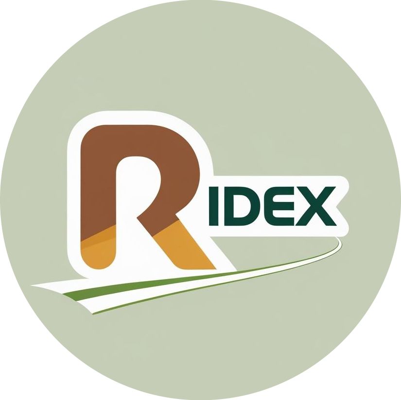

#  Ridex


**Ridex** is a MERN-based ride-hailing and logistics platform for the web, inspired by real-world systems like Pathao. Built backend-first with modular APIs, WebSocket-based tracking, and role-based access, Ridex serves **customers**, **drivers**, and **admins** in real-time.

---

## 📚 Table of Contents

- [About](#about)
- [Features](#features)
- [Technology Stack](#technology-stack)
- [Project Phases & Progress](#project-phases--progress)
- [Getting Started](#getting-started)
- [Contact](#contact)

---

## 📖 About

Ridex is designed to replicate the mobile-native experience of ride-hailing apps for the web using a real-time architecture. From authentication to booking and live location tracking, each module is built with reusability, scalability, and mobile integration in mind.

---

## ✨ Features

- **Role-Based Access**: Admin, Driver, Customer
- **User & Vehicle Management**
- **Ride Request, Matching, and Booking**
- **Real-Time Driver Availability & Trip Status**
- **Trip History, Receipts, and Feedback**
- **Admin Analytics Dashboard**
- **Future-Ready Mobile APIs**

---

## 🧰 Technology Stack

| Layer       | Tech                          |
|-------------|-------------------------------|
| Frontend    | React, Tailwind, Redux Toolkit (optional), React Router |
| Backend     | Node.js, Express.js, Socket.IO, JWT, bcrypt |
| Database    | MongoDB, Mongoose, GeoJSON     |
| Real-time   | WebSockets via Socket.IO       |
| Utilities   | Multer, dotenv, CORS, morgan   |

---

## 📈 Project Phases & Progress

### ✅ Phase 1: Authentication & Admin Controls

<details>
<summary>Backend</summary>

- [✅] Setup Express server and MongoDB connection  
- [✅] User model with roles: `admin`, `driver`, `customer`  
- [x] JWT-based authentication system  
- [x] Password hashing (bcrypt)  
- [x] Auth middleware  
- [x] Role-based access control  
- [] Admin-only routes for managing users  
- [x] Login activity logging  
</details>

<details>
<summary>Frontend</summary>

- [✅] Auth pages (register, login)  
- [x] Token handling + Axios interceptor  
- [✅] Admin dashboard: user management table  
- [x] Protected route guards  
- [x] Global state (Redux Toolkit or Context API)  
</details>

---

### 🚧 Phase 2: Driver Module & Ride Booking

<details>
<summary>Backend</summary>

- [x] Driver schema: profile, vehicle, availability  
- [x] Driver status toggle endpoint  
- [ ] Ride schema with lifecycle status  
- [ ] Matching logic (nearby driver selection)  
- [ ] Real-time status updates via Socket.IO  
- [ ] Trip history & ratings model  
</details>

<details>
<summary>Frontend</summary>

- [x] Driver dashboard UI  
- [x] Vehicle profile form  
- [ ] Live ride request view  
- [ ] Trip history page  
- [ ] WebSocket-based updates  
</details>

---

### 🔜 Phase 3: Customer Booking & Tracking

<details>
<summary>Backend</summary>

- [ ] Booking creation endpoint  
- [ ] Driver discovery via geolocation (GeoJSON)  
- [ ] Booking lifecycle & updates  
- [ ] Receipt & fare breakdown  
- [ ] Feedback + rating system  
</details>

<details>
<summary>Frontend</summary>

- [ ] Request Ride form  
- [ ] Live driver map with markers  
- [ ] Real-time ride tracking  
- [ ] Payment UI + Trip summary  
- [ ] Feedback & ratings submission  
</details>

---

### 🧪 Phase 4: Admin Analytics & Mobile Prep

<details>
<summary>Backend</summary>

- [ ] Aggregated stats (total trips, revenue, activity)  
- [ ] Reports + logs endpoints  
- [ ] FCM token storage for push notifications  
- [ ] Redis or similar for caching popular queries  
</details>

<details>
<summary>Frontend</summary>

- [ ] Analytics dashboards for admin  
- [ ] Notification UI & framework  
- [ ] Mobile responsiveness and testing  
</details>

---

## ⚙️ Getting Started

### Prerequisites

- Node.js (v18+)
- MongoDB (local or Atlas)
- Postman or Insomnia

### Installation

```bash
# Clone project
git clone https://github.com/your-username/ridex
cd ridex

# Install backend
cd backend
npm install
npm run dev

# Install frontend
cd ../frontend
npm install
npm start
```

---

## 📬 Contact

- 🧑‍💻 Lead Developer: Siddartha Kunwar 
- 📧 Email: siddartha.kunwar01@gmail.com 
- 🌐 GitHub: https://github.com/siddarth0

---
